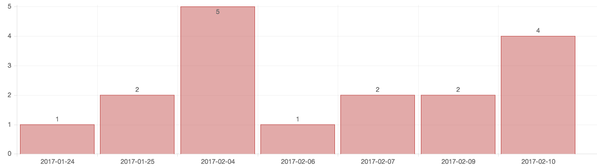

## 豆尖学生端App研发报告---Sprint 1
### 开发任务总览

### 项目当前状态

### 项目整体计划
1. Sprint 1 (2.4-2.10)
  - App主体框架完成

2. Sprint 2 (2.13-2.17)
  - 完成学生端所有功能，提供测试包

### Sprint 1 开发状态总览

### Sprint 1 开发进度
1. 移动端开发任务
  - App主体框架（包括导航栏选择，存储逻辑等App通用内容） -完成
  - 寄宿家庭身份选择页面    -完成
  - 住宿日期选择页面    -完成
  - 住宿地址选择页面    -完成
  - 服务项选择动画效果   -完成
  - 进度条效果   -完成
  - 测试用例    -完成

2. 后端
  - POI搜索API   -完成
  - 家庭端API    -进行中

### 安装包链接
- [iOS测试包下载](https://www.teambition.com/project/587449ce8ff84e0451f4c551/works/587c56969a46b2ef71e242ed/work/589d7f7702891cf650fc679e)
- [Android测试包下载](https://www.teambition.com/project/587449ce8ff84e0451f4c551/works/587c637bc0323df932235562/work/589d909554a217c932a81bb6)

### 测试用例
#### 常规测试用例
1. 首次启动
  - 是否出现欢迎界面，欢迎界面的停留时间合理，欢迎界面后是否正常进入应用;
  - 首次启动时间是否合理;
  - 该拉取的信息是否正确;

2. 二次启动
  - 启动时间是否符合预期；
  - 二次启动的时候正常回复登录状态;

3. 程序异常退出后的启动
  - 操作出现crash后再启动：如空指针、内存溢出等
  - 手动停止进程：多进程的情况停止所有或者停止其中一个后重启
  - 手动停止服务：多服务的情况，停止所有或者停止部分服务后，未重启直接使用
  - 其他系统软件工具停止进程、清理软件数据

4. 文本框输入功能
  - 正常输入，输入越界，特殊字符集(\n,\r等等)
  - 键盘回收问题

5. 事件触发
  - 每一个按钮、每一个可点击项是否能够完成需求规定的功能

6. 网络与流量
  - 网络信号，尤其是弱网络环境下应用的表现
  - 不同运营商网络：电信、联通、移动，2G/3G/4G
  - 网络中断、网络恢复场景的逻辑处理（如重试），以及网络提示

7. 中断测试
  - 锁屏中断：停留在程序操作界面进行锁屏，恢复后检查操作是否正常
  - 前后台切换：停留在程序操作界面，通过Home键，进行程序的前后台切换
  - 加载中断：页面接口请求、界面框架加载时，通过Home键、返回键、快速切换操作进行中断
  - 系统异常中断：如关机、断电、来电

8. 机型适配
  - UI结构、对话框基于分辨率、屏幕大小进行适配
  - OS版本适配

9. 性能
  - 稳定性：选择某些场景做持续反复操作
  - 流畅度：列表滑动、返回进入、快速点击

#### 业务相关测试用例
1. 导航条
  - 能否正常切换页面
  - UI效果是否符合预期

2. 进度条
  - 进度条逻辑是否正确
  - 进度条UI是否符合预期

3. 日期选择
  - 选择开始日期、结束日期逻辑是否正确
  - UI是否符合预期

4. 入住区域选择
  - 地址搜索联想功能
  - 地址标注
  - 感兴趣区域标注拖动
  - 默认地理位置是否符合预期
  - UI是否符合预期
