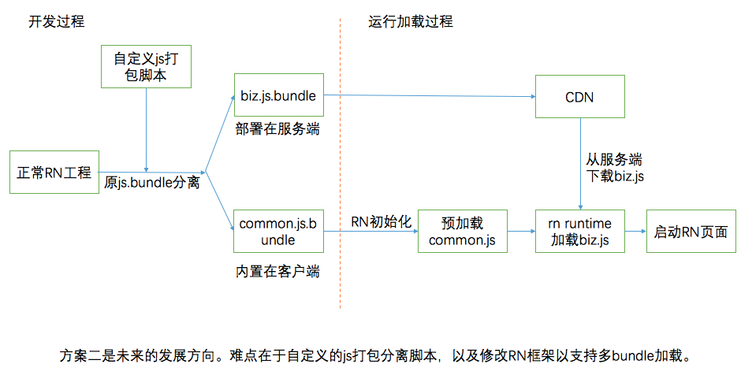
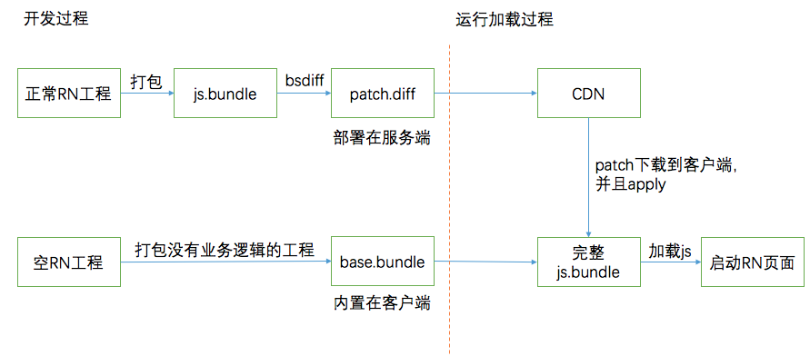
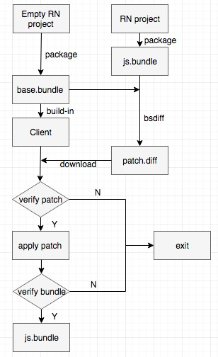

## React Native 分包方案  
&emsp;&emsp;由于React Native在业务代码打包时，会将所有依赖的js都打包成一个完整的js.bundle，因此导致包体积较大。在处理多页面或者多业务场景时，会使用到多个包。这种情况下，包过大会导致大量的冗余代码下载，很慢的加载速度，用户体验很差，因此需要进行分包。

### 方案
&emsp;&emsp;考虑到依赖的js基础库基本完全相同，因此想到将公共部分独立提取出来，作为基础js库，直接内置在客户端本地，供业务代码依赖使用。  
现行的方案有两种:
- 使用脚本进行处理，在打包时即将js.bundle分拆为common.js和business.js。将common.js内置在客户端，business.js则部署在服务端。由于现有的RN框架不支持多js加载，因此客户端在下载完business.js后，需要先合并js，然后再加载。（携程使用的是此方案)

  

- 首先建立一个无业务代码的RN工程，并打包，得到base.bundle并内置在客户端。然后打包正常的业务工程，得到js.bundle。对两者进行bsdiff，获取patch，并部署在服务端。客户端下载patch后，apply patch，获得完整的js.bundle，再进行加载。（58使用的是此方案）

  

&emsp;&emsp;对比两种方案，前者的打包处理脚本较为复杂，同时存在RN版本间的兼容性问题。后者使用bsdiff，更加稳定和通用。因此，我们使用后者作为我们的分包方案。

### 流程
1. 为特定版本的RN制作无业务逻辑的base.bundle，并内置在客户端中。
2. 业务开发正常开发调试打包业务。
3. 使用bsdiff得到diff文件，并部署在服务端。
4. 客户端下载diff文件，并apply到本地的base.bundle上，得到完整的js.bundle。
5. 客户端加载并运行RN页面。  

  

### 数据
&emsp;&emsp;使用最新的电商demo以及之前的独立转盘demo进行测试，diff的效率很理想，比js.bundle和base.bundle之差更小一些。  

| base.bundle   | js.bundle     | patch.diff  |
|:-------:|:------:|:-----:|
| 558,777字节     | 798,113 字节 | 79,835 字节 |
| 558,777字节     | 581,480 字节  |   18,821 字节 |

&emsp;&emsp;对电商demo，在荣耀7上进行apply测试若干次，其中：
- 耗时时间基本在5ms-20ms之间。
- cpu占用在5%以下。
- 内存分配稳定，基本可以忽略。
