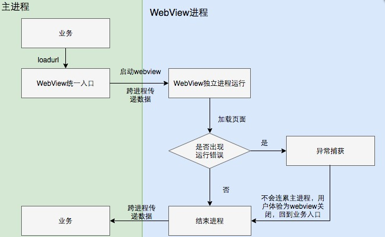

## Android WebView独立进程详解  
Android的WebView的崩溃数量相对于iOS平台来说，不是同一个量级的。对于其中的很多问题，由于涉及到系统层面的代码，我们缺少有效的手段去予以修复。  

  独立进程方案就是在此种背景下诞生的。

### WebView的问题

- 网页代码质量不可控  
很多时候，网页的代码并非全部由己方完成，部分页面是由外部厂商提供，比如广告，跳转链接等。其代码质量是无法予以保障。举个例子，从下面的log，我们可以看出，mgtv直接将开发代码放到了正式环境，而这段代码还需要去github去下载vue-devtools，最终timeout导致页面加载不完全。

```C++
The key "minimal-ui" is not recognized and ignored. -- From line 6 of http://m.mgtv.com/#/b/292390/3306125?cxid=9571sxdjy&deviceId=61162a48cf51cb6839dc1409c7360dbb&qyid=868819022170454&platform=GPhone&network=1&ov=4.4.3&location=118.196877,24.526222&src=android&ref=  
Download the Vue Devtools for a better development experience:https://github.com/vuejs/vue-devtools -- From line 24 of http://m.mgtv.com/js/app.4a882c4395b3165ee051.js?523b2815ac91b66250ea  
create messenger -- From line 6 of http://m.mgtv.com/js/playpage.bac6d8fd90af0de86ca9.js
```

- WebView本身问题较多  
WebView本身是存在不少bug的，google一直在进行积极的修复工作中，甚至中途换过一次内核。但由于系统版本碎片化严重，很多用户升级不及时，因此依然影响很大。Java和Native的崩溃中都包含了大量WebView相关的崩溃，除此以外还有OOM问题。例如，在Android 4.1.2的版本中，就有如下已知问题，这个问题在我们现在的崩溃日志中依然每天都能见到。

```C++
java.lang.IllegalArgumentException: bad parameter at org.apache.http.client.utils.URLEncodedUtils.parse(URLEncodedUtils.java:139)
at org.apache.http.client.utils.URLEncodedUtils.parse(URLEncodedUtils.java:76)
at android.webkit.AccessibilityInjector.getAxsUrlParameterValue(AccessibilityInjector.java:412)
at android.webkit.AccessibilityInjector.shouldInjectJavaScript(AccessibilityInjector.java:327)
at android.webkit.AccessibilityInjector.onPageFinished(AccessibilityInjector.java:286)
at android.webkit.WebViewClassic.onPageFinished(WebViewClassic.java:4088)
at android.webkit.CallbackProxy.handleMessage(CallbackProxy.java:332)
at android.os.Handler.dispatchMessage(Handler.java:99)
at android.os.Looper.loop(Looper.java:137)
at android.app.ActivityThread.main(ActivityThread.java:4829)
at java.lang.reflect.Method.invokeNative(Native Method)
at java.lang.reflect.Method.invoke(Method.java:511)
```

- Android厂商自行修改  
Android厂商的兼容性问题严重，在特定厂商的特定版本上会有难以解决的问题。这类问题通常是用于厂商擅自修改源码，且未严格进行测试导致的。相信任何一个Android开发，都有过适配不同厂商的经历，这里仅针对WebView的问题举两个例子：  
  - 某天的WebView的native崩溃的数据如下: libwebviewchromium.so总崩溃数为89920次。其中，VIVO占70950(78.98%)，OPPO占15281(17.01%)。5.1.1系统占59530(66.2%)，5.1系统占24877(27.67%)。可以看出，崩溃非常集中的分布在o/v手机的5.1和5.1.1版本。

  - 今年4月的某天的崩溃数据显示，乐视手机突然出现了大面积的崩溃，没有任何先兆。调用栈显示WebView中调用了SQLite的相关操作并崩溃，但在Android源码中并未发现有此段代码。最后，在乐视的官方论坛上发现，乐视于崩溃前一天发布了新版本的Rom。

### 具体方案
Android WebView独立进程是指在WebView加载具体页面时，独立运行在自身的进程中，不与app的主进程在一起。在业界，这是一个非常通用的解决方案，有大量的资料可供参考和借鉴。通过这种方式，隔离了WebView的运行环境，保证了其不稳定性不会影响到主程序。用户对此的感知主要是

由于Android本身支持App运行在多个进程中，因此，独立进程的方案实现较简单，只需要在AndroidManifest中找到对应的WebViewActivity，对其配置"android: process"属性即可。    

重点需要注意的是跨进程数据传递和调用的处理，如果有js代码的注入，需要检查其是否可以正常跨进程的运行。

独立进程方案流程如下：  



### 分析总结

- 在上线之前的版本，WebView的每日崩溃数约为9-11万次，在整体崩溃中的占比也较高。

- 上线的时候，挑选了第三方厂商提供的广告页面进行了独立进程改造，从而避开了js注入导致的跨进程调用问题。

- 上线后，每日的WebView总崩溃数约为8-10万次。 其中，大约5万次左右的崩溃在独立的进程中发生，从而很好的保障了用户体验。

- 本质上，独立进程是个治标不治本的方法，并且也不是所有场景都适用。对于内部提供的页面，涉及到较多逻辑封装，跨进程改造会有较高的成本。采用第三方内核是更值得考虑的方案，比如接入腾讯的x5内核。
