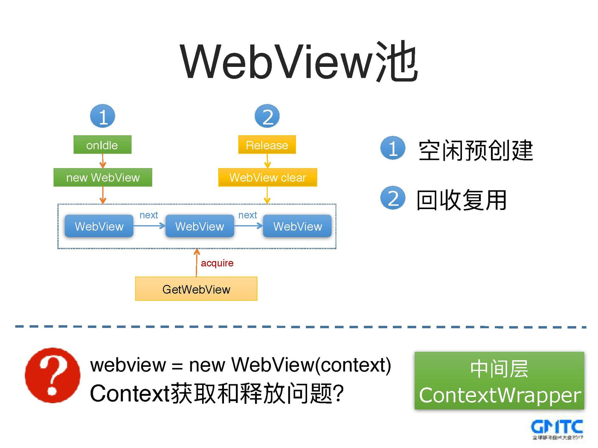
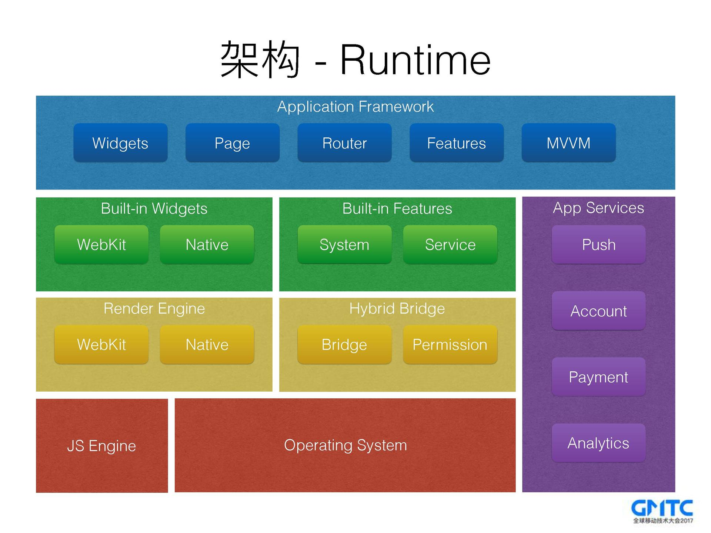
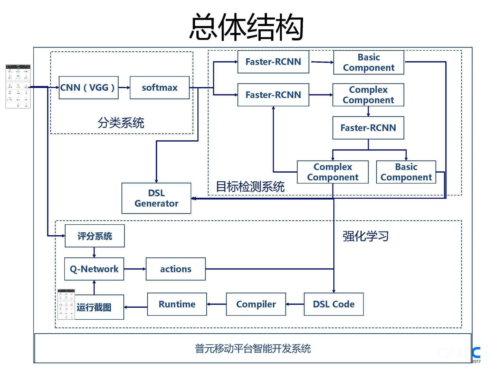
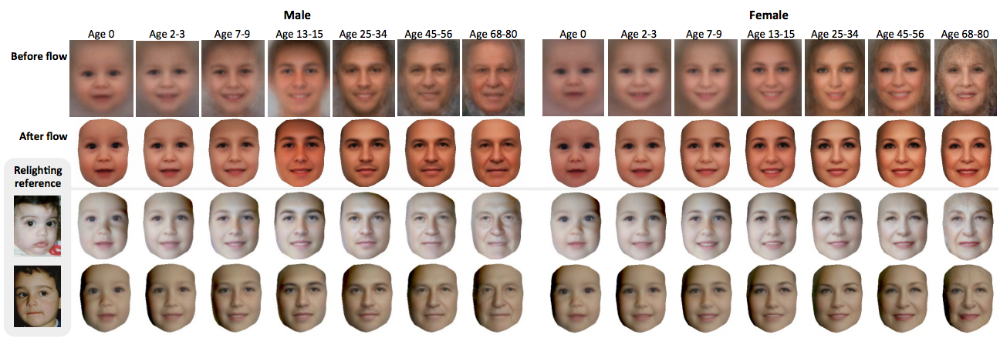
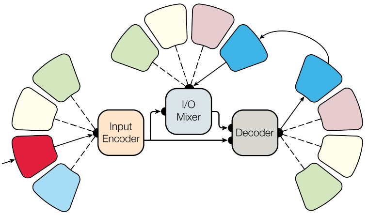
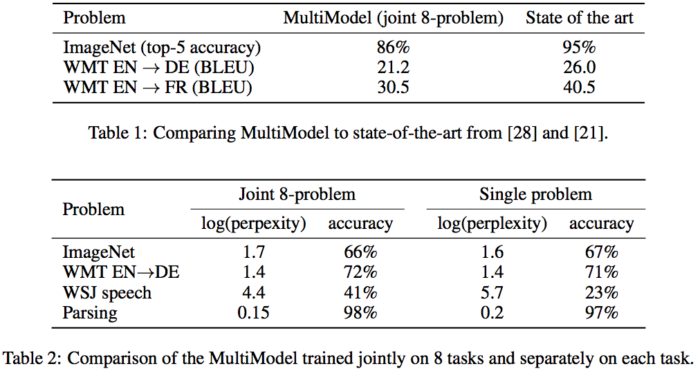

### [业务水平高的职工，为何会得不到晋升](http://mp.weixin.qq.com/s/QNERqMO0pSlI_d8vPJ1ahQ)

在码农圈子混过几年的同志们应该都有过这样的经历：xxx的技术能力很强，为啥就一直是个基层小码农；明明比我的leader能干多了，为啥要汇报给他。更有甚者，知乎上有问：[“马云不写代码，他凭什么拥有淘宝？”](https://www.zhihu.com/question/25361619)。罗辑思维的这篇文章，跟大家共勉：

- 专业人士，衡量你价值的，是你的专业水平
- 当企业高管，衡量你价值的，是你能把一摊事接走的能力
- 什么意思？专业人员，本质上是大协作系统的一个零件，你本事再大，也是这个零件本身优秀
- 而在企业当高管，是你自己运营一个系统。最大的价值，是你能否独当方面，一件事交给你，就可以放心了。公司找高管，本质上就是在找这样的人

真正决定一个人高度的，不是自身的专业技能，而是他调动周围资源的能力。业务水平高低，不是你升职与否的原因。是不是让上层觉得你是可以托付事儿的人，才是问题的核心。

### [QQ移动页面框架优化实践](http://ppt.geekbang.org/slide/show/862)

作者介绍了移动端H5页面的优化思路，主要包含传统页面的优化实践和动态直出页面的优化实践。H5页面主要是由静态资源(JS/HTML/CSS)和动态数据构成，其中静态资源一般是通过CDN分发的，动态数据是从数据后台获取的。H5页面的加载流程以及耗时分布如下图，用户点击打开某个H5页面到看见这个页面这段时间通常被称作首屏耗时，它是影响H5页面体验的最关键的一个指标。

首屏耗时取决于终端耗时和页面耗时，其中终端耗时通常指的是WebView内核的加载时间，页面耗时则包括了请求静态资源渲染页面和请求动态数据刷新DOM的时间。

所以这里存在了几个问题：
- WebView内核加载 -> 请求静态资源是一个串行的过程，直接导致影响了首屏时间
- 弱网情况下拉取静态资源和内容会比较慢，导致了首屏白屏时间较长

对应的优化方案有：
- WebView加载优化：启动流程、进程预加载、WebView池
- 页面体验优化：图片自适应、静态直出
- 网络请求优化：DNS预解析、离线预推

PPT中介绍了动态直出页面的优化思路：并行请求、流式拦截、增量更新、预加载、自定义通道、IP直连等方案，详细的可以看看PPT和分享视频。

### [小米的混合开发框架实战](http://ppt.geekbang.org/slide/show/854)

作者期望的目标是实现这样的一个开发框架：
- 无需下载和安装
- 接近原生的能力
- 接近原生的体验和性能
- 学习门槛低，开发效率高
- 支持降级处理

Runtime架构如下：

PPT中介绍了前端技术栈、渲染引擎、应用框架、Runtime、页面生命周期、组件化、页面布局和样式、平台化、秒开优化等关键点的技术细节，详细的可以看看PPT和分享视频。个人感觉看上去像是基于React Native，结合自己的业务场景和需求，再造一个轮子。

### [使用TensorFlow搭建智能开发系统，自动生成App UI代码](http://ppt.geekbang.org/slide/show/848)

这是GMTC 2017最吸引我的一个Topic。作者期望训练一个能读懂移动UI的模型，然后根据设计稿或者App截图直接生成App前端代码：
- 通过移动平台在各个项目组的实施，收集到各类移动界面图片，作为数据集
- 使用CNN和softmax做界面分类
- 采用多级目标检测，确定UI元素
- 基于DSL生成代码
- 强化学习对代码微调

总体结构如下：

### [如何预测一个人(孩子)若干年后的相貌？](http://grail.cs.washington.edu/aging/)

很有意思的一篇论文，[Illumination-Aware Age Progression](http://grail.cs.washington.edu/aging/Aging_CVPR14.pdf)

### [如何建立自动检测乳腺癌的深度学习模型](http://mp.weixin.qq.com/s/--ORsBW1TFpaBHEx6T8pbw)

乳腺癌是导致全球女性死亡的第二大癌症类型，一般来说，医生都会建议健康女性一年做一次乳腺癌检查，传统的检查流程一般包括乳房X射线和超声图像检测，但这是一种比较主观的诊断，非常依赖医生的水平。

iSono Health是一个初创公司，致力于开发低成本的自动超声图像检测平台，促进女性每月进行乳腺癌自我检测。借助iSono的app分析检测结果，它能够用超声图像区分乳腺肿块是良性还是恶性的，并且可以实时记录并查看。

Sono Health提供了一份原始数据集，包含2684个JPEG格式的2D乳腺超声检测图像。我们将这些原始数据进行了归类：
- 良性案例：1007例
- 恶性病例：1499例
- 非典型病例：178例
- 良性致病类型：12例
- 恶性致病类型：13例
- 非典型致病类型：3例
大多数的超声检测图像大小为300x225像素，每个像素的值在0到225之间。为了使病变检测成为一个二进制的分类问题（良性或恶性），我忽略了所有的致病类型和非典型病例信息，并随机挑选了1920张图像用于建立和评估模型——这些图像中一半是良性的，而另一半是恶性的，是一个相对平衡的数据集。

对于乳腺癌这种复杂的图像分类问题，1920张图像是一个相对较小的数据集。扩充数据能够减少过度拟合，增强模型的泛化能力，是极具吸引力的解决方案。我们将这个数据集分成三部分，75%用于训练，12.5%用于验证，剩下的12.5%作为测试数据集。基于乳腺病变对旋转并不敏感的假设，我将每张图片进行旋转。具体来说，就是将每张图片在-10°到10°之间随机进行旋转，并重复了12次，最终得到1920x12=23040张图像。因为我想让整个病变区位于图像的核心，所以并没有使用裁剪或移动等其他的增强技术。根据观察，几乎所有图片中的病变区（包含病变处和四周）都在图像中央，因此我可以把图片裁剪成200x200像素大小，这样也能移除图像旋转引起的填充。为了保持网络可控，每张图像降低采样到原图像的五分之一，也就是40x40像素大小。下面这张图就是数据准备的流程图。

在这个项目中，我研究并比较了两种不同深度学习架构的表现——即全连接神经网络(FCNN)和卷积神经网络(CNN)。这两种模型都是使用python和TensorFlow在Nvidia Tesla K80 GPU上实现的，用的是亚马逊云服务(AWS)EC2 p2.xlarge。
在一个卷积神经网络中，每个神经元只与前一层的几个局部神经元联系在一起，并且在该层中每个神经元的权重相同。因为卷积运算产生的信息与图像的空间特性相关，因此卷积神经网络很适合解决图像分类问题。我构建的卷积神经网络有三个卷积层，每一层都是上一层的图像通过5*5的滤波器/内核（kernel）卷积形成。将一个卷积层的输出输入给另一个卷积层，可以提取出更高阶的特征。卷积后，这些特征可更容易被全连接网络学习。卷积层可以被看做是为数据做准备的，让全连接层能够利用输入图像的空间结构。我的直觉是，在图像经过多个卷积层后，神经元将被编码成完全相关的空间特征。卷积层后有两个全连接层，分别有512和256个节点。这个卷积神经网络架构的灵感来自AlexNet的前几层，下图显示了详细的信息。

在第3000次训练迭代后，卷积神经网络的精确度快速且平稳地增加到0.9，而全连接神经网络在经过10000次迭代后还达不到这一水平。另一方面，卷积神经网络的损失值比全连接神经网络要低，这表明卷积神经网络中的梯度下降函数在收敛到局部最小值处表现最好。

### [一个神经网络学习一切！谷歌又放了个大卫星](http://mp.weixin.qq.com/s/ARnDNJkLSkTOBtQ7w50cSg)

深度学习挺好，但是每解决一个问题都得建一个模型，还要花好长时间调参、训练，太麻烦了。于是乎Google Brain的同学搞出了一个在各种领域的很多问题上效果都不错的模型MultiModel，并且号称："One Model To Learn All"。

目前相关工作人员正在用下面这8个数据集训练这个模型，期望能识别ImageNet图像、进行多种语言的翻译、在COCO数据集上根据图片生成文字说明、做语音识别、做英文语法分析：

- 《华尔街日报》语音语料库
- ImageNet数据集
- COCO图片说明数据集
- 《华尔街日报》句法分析数据集
- WMT英-德翻译预料库
- WMT德-英翻译预料库
- WMT英-法翻译预料库
- WMT法-英翻译预料库

为了在不同维度、大小、类型的数据上进行训练，MultiModel由多个特定模式的子网络对这些输入数据进行转换，并放进一个共同的表示空间。这些子网络叫做“模式网络(modelity nets)”。如图所示，MultiModel由几个模式网络、一个编码器、一个I/O混合器、一个自回归解码器构成，模型的主题包含了多个卷积层、注意力机制和稀疏门控层等。具体的细节可以在看[One Model To Learn All](https://arxiv.org/pdf/1706.05137.pdf)这篇论文。

作者使用TensorFlow实现了MultiModel模型，下面这个表格是对比数据，从实验结果来看，处理ImageNet图像识别的效果没有明显优势，其他的几项效果都略好。

