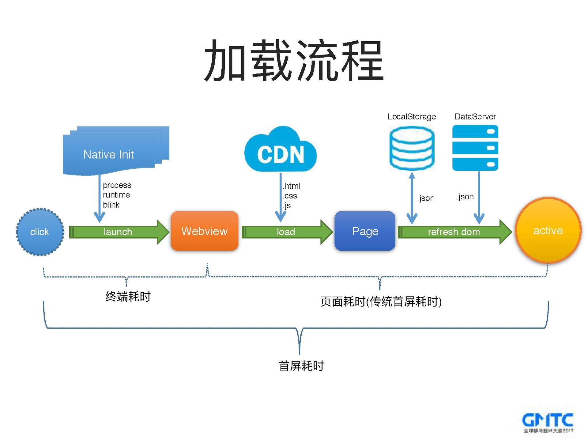

### 神经元

作者介绍了移动端H5页面的优化思路，主要包含传统页面的优化实践和动态直出页面的优化实践。H5页面主要是由静态资源(JS/HTML/CSS)和动态数据构成，其中静态资源一般是通过CDN分发的，动态数据是从数据后台获取的。H5页面的加载流程以及耗时分布如下图，用户点击打开某个H5页面到看见这个页面这段时间通常被称作首屏耗时，它是影响H5页面体验的最关键的一个指标。

### 参考资料
- http://www.nustm.cn/blog/index.php/archives/843#2